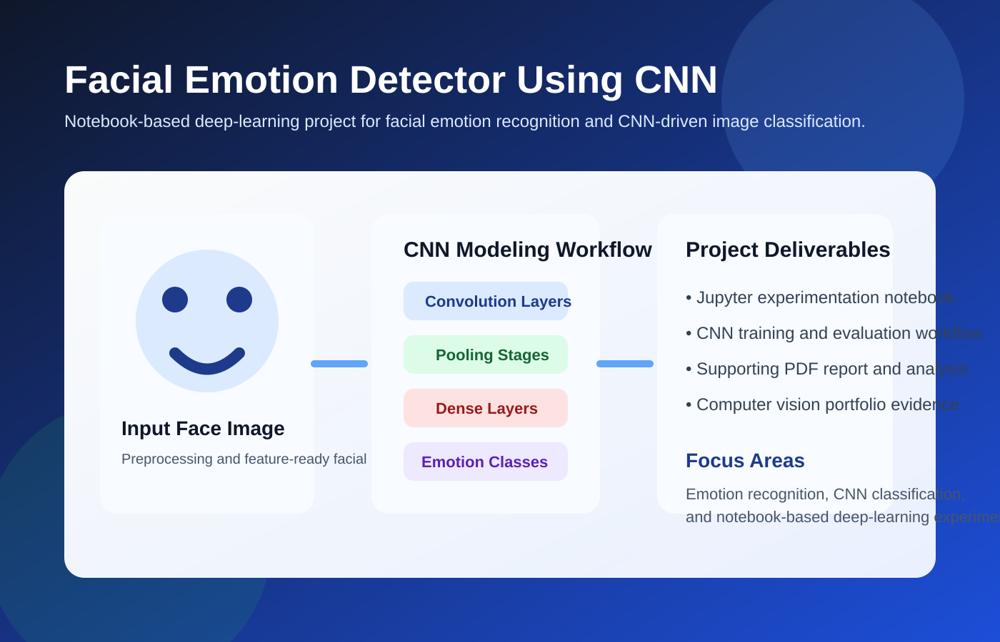

# Facial Emotion Recognition CNN

A computer-vision project focused on **facial emotion recognition** with convolutional neural networks.

This repository is best understood as a **notebook-driven deep-learning workflow** backed by a supporting written report. It is positioned as a practical affective-computing project rather than a polished end-user application.

## Problem this project solves

Human emotion signals are useful in systems such as:

- learning and tutoring tools
- human-computer interaction research
- accessibility and assistive interfaces
- customer-feedback and engagement analysis

The challenge is that facial expressions vary in lighting, pose, intensity, and image quality. A model must learn to distinguish subtle visual cues across multiple emotional categories.

This project explores that problem using CNN-based image classification.

## What this project does

The repository focuses on:

- image-based facial emotion classification
- CNN model experimentation in Jupyter
- model training and evaluation
- documented methodology through an attached PDF report

## Visual overview

## Repository contents

- `deep-learning-assignment.ipynb`: main experimentation notebook
- `Multi-Task Emotion Recognition using Deep Learning.pdf`: written project report
- `docs/screenshots/emotion-overview.svg`: visual project summary

## Why this project matters

- It demonstrates practical deep-learning workflow in computer vision.
- It shows interest in affective computing and facial analysis.
- It includes both implementation and written project documentation.
- It works well as a research or academic portfolio artifact.

## Typical workflow

1. open the notebook in Jupyter or Colab
2. install required deep-learning dependencies
3. run the notebook cells sequentially
4. review the PDF report for methodology, modeling choices, and conclusions

## Industrial positioning

A production-ready emotion-recognition system would need much more than a training notebook. For example:

- curated and balanced datasets
- bias and fairness evaluation
- real-time inference optimization
- camera input handling
- privacy and consent safeguards
- reliability testing across lighting and pose conditions

That means this repository is best presented as a **deep-learning foundation project** for emotion recognition, not a finished product.
